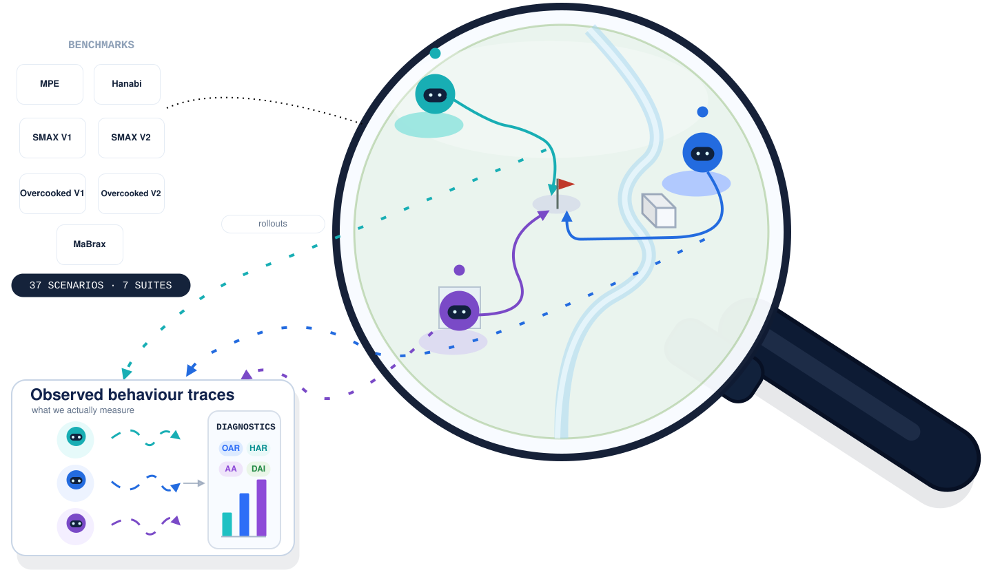

# Probing Dec-POMDP Reasoning in Cooperative MARL

<p align="center">
  <a href="https://arxiv.org/abs/2602.20804"></a>
  <a href="https://www.kaleabtessera.com/probing"></a>
  <a href="LICENSE"></a>
</p>
<p align="center">
  
</p>


Metrics introduced in [Probing Dec-POMDP Reasoning in Cooperative MARL](https://arxiv.org/abs/2602.20804) (Oral, AAMAS 2026).

This repository provides information-theoretic diagnostics for cooperative MARL trajectories. Given trained-policy rollouts, the package computes five probes, compares them against permutation nulls, and helps audit what behaviours are induced under the policy distribution rather than relying only on return.

Use it when you want to ask:

- Do actions depend on memory beyond the current observation?
- Does one agent carry private information that predicts another agent's action?
- Is coordination mostly synchronous action coupling, or is there temporal influence across agents?

Quick links: [Installation](#installation) | [Quickstart](#quickstart) | [CLI](#cli-reference) | [Citation](#citation)

## The five diagnostics

For agent $i$ at time $t$, let $O_t^i$ denote the local observation, $A_t^i$ the action, $H_t^i$ the history representation, and $\tau_{t-1}^i$ the action-observation history up to $t-1$. For recurrent policies, $H_t^i$ is the RNN hidden state. For feed-forward policies, history is approximated using a length-$k$ window, such as $O_{t-k:t-1}^i$ or $(O_{t-k:t-1}^i, A_{t-k:t-1}^i)$, depending on the diagnostic.

All diagnostics measure predictive statistical dependence under the rollout distribution, not causal influence and not worst-case/best-case properties of the environment. They should be interpreted together with the memory-reactive performance gap, permutation-null baselines, bootstrap uncertainty, and behavioural evaluations.

| Diagnostic | Definition | If high, suggests… | Implementation |
|---|---|---|---|
| **OAR** | $I(O_t^i; A_t^i)$ | The current observation is highly predictive of the agent’s action. This is consistent with more **reactive behaviour**, especially when **HAR** is low. | `compute_oar` |
| **HAR** | $I(H_t^i; A_t^i \mid O_t^i)$ | The agent’s action depends on history beyond the current observation. This indicates **history-dependent behaviour**, but not necessarily performance-critical memory use ($\Delta_{\mathrm{Mem}}$ can help with that). | `compute_har_hidden` (RNN), `compute_har_ohist` (FF) |
| **PIF** | $I(\tau_{t-1}^i, O_t^i; A_t^j \mid \tau_{t-1}^j, O_t^j)$ | Agent $i$'s trajectory and current observation contain additional predictive information about agent $j$'s action beyond $j$'s own history and observation. This is consistent with **cross-agent information asymmetry**, where one agent’s information helps predict another agent’s behaviour.| `compute_pif_hidden` (RNN), `compute_pif_oa_hist` (FF) |
| **AA**  | $I(A_t^i; A_t^j \mid O_t^i, O_t^j)$ | Residual same-timestep action dependence remains after conditioning on both agents’ current observations. This is consistent with **instantaneous conventions**, **symmetry breaking**, or shared unobserved drivers. | `compute_aa` |
| **DAI** | $T^{-1}\sum_t I(\tau_{t-1}^i; A_t^j \mid \tau_{t-1}^j)$ | Agent $i$'s past provides additional predictive information about agent $j$'s future action beyond $j$'s own past. This is consistent with **temporally directed dependence**. | `compute_dai_hidden` (RNN), `compute_dai_oa_hist` (FF) |

Each diagnostic also has a normalised form in $[0, 1]$, obtained by dividing by the relevant action entropy or residual action entropy:

- **OAR**: divided by $H(A_t^i)$.
- **HAR**: divided by $H(A_t^i \mid O_t^i)$.
- **PIF**: divided by $H(A_t^j \mid \tau_{t-1}^j, O_t^j)$.
- **AA**: divided by $H(A_t^j \mid O_t^i, O_t^j)$.
- **DAI**: divided by $T^{-1}\sum_t H(A_t^j \mid \tau_{t-1}^j)$.

We also compute a permutation-null baseline for each diagnostic. The action sequence is shuffled within each agent, preserving marginal action statistics while destroying temporal and cross-agent dependencies. A diagnostic is treated as **above-null** only when its value on the original trajectories exceeds the mean over null replicates. This helps account for finite-sample bias and noise in MI estimators.

The **memory-reactive performance gap** $\Delta_{\mathrm{Mem}} = J(\pi_{\mathrm{RNN}}) - J(\pi_{\mathrm{FF}})$ is computed from training-time evaluation returns rather than trajectory data, so it lives outside this package.

## Installation

Requires Python ≥ 3.10. Core dependencies are NumPy, SciPy, scikit-learn, pandas, joblib, and rliable. The package is tested on Python 3.12.

Install the released package:

```bash
pip install dec-pomdp-diagnostics
```

Install from source for development:

```bash
git clone https://github.com/KaleabTessera/probing-dec-pomdps.git
cd probing-dec-pomdps
pip install -e .
```

Install test/development extras:

```bash
pip install -e ".[dev]"
pytest
```

## Quickstart

If you already have MARL trajectories, you do not need the W&B pipeline. Wrap your arrays in `UserData`, call `compute_diagnostics` for each `(environment, algorithm, seed)` run, then use `build_paper_table` to aggregate results across scenarios.

Expected array shapes:

- `observations[agent]`: `(N, obs_dim)`
- `actions[agent]`: `(N,)` for discrete actions or `(N, act_dim)` for continuous actions
- `timesteps[agent]`: `(N,)`, integer step within episode
- `episode_ids[agent]`: `(N,)`, integer episode or parallel-env id
- `hidden_states[agent]`: optional `(N, hidden_dim)` for recurrent policies

```python
import numpy as np
import dec_pomdp_diagnostics as dpd

rng = np.random.default_rng(0)
# N = total steps, T = timesteps per episode
N, obs_dim, T = 1200, 8, 24
n_eps = N // T
obs0 = rng.normal(size=(N, obs_dim)).astype(np.float32)
obs1 = rng.normal(size=(N, obs_dim)).astype(np.float32)
act0 = rng.integers(0, 2, size=N, dtype=np.int64)
act1 = rng.integers(0, 2, size=N, dtype=np.int64)
ts = np.tile(np.arange(T, dtype=np.int64), n_eps)
eps = np.repeat(np.arange(n_eps, dtype=np.int64), T)
Sd = {"agent_0": obs0, "agent_1": obs1}
Td = {"agent_0": ts, "agent_1": ts}
Ed = {"agent_0": eps, "agent_1": eps}

# OAR: raw action arrays from rollouts.
Ad = {"agent_0": act0, "agent_1": act1}
oar, oar_norm = dpd.compute_oar(Sd, Ad)
print(oar_norm)

# HAR / PIF / AA / DAI use the same raw-array pattern.
har, har_norm = dpd.compute_har_ohist(Sd, Ad, Td, Ed, k_window=3)
pif, pif_norm, _ = dpd.compute_pif_oa_hist(Sd, Ad, Td, Ed, k_window=3)
aa, aa_norm, _ = dpd.compute_aa(Sd, Ad, Td, Ed)
dai, dai_norm, _ = dpd.compute_dai_oa_hist(Sd, Ad, Td, Ed, k_window=3)

result = dpd.compute_diagnostics(
     dpd.UserData(
         observations={"agent_0": obs0, "agent_1": obs1},
         actions={"agent_0": act0, "agent_1": act1},
         timesteps={"agent_0": ts, "agent_1": ts},
         episode_ids={"agent_0": eps, "agent_1": eps},
         env_name="my_env",
         alg_name="IPPO",
         seed=0,
     ),
     history_k=3,
     null_reps=5,
 )
print(result.describe())
# Run my_env/IPPO/seed0:
#   ✗  Do actions depend on history?  (Diag 2: HAR^norm > permutation null, HAR^norm=0.0430, HAR^null=0.0442)
#   ✗  Does teammate information help predict another agent's actions?  (Diag 4: PIF^norm > null, PIF^norm=0.0377, PIF^null=0.0355)
#   ✗  Does synchronous coordination emerge?  (Diag 5: AA^norm > null, AA^norm=0.0278, AA^null=0.0278)
#   ✗  Does temporal coordination emerge?  (Diag 6: DAI^norm > null, DAI^norm=0.0365, DAI^null=0.0360)
#   Note: flags are guidance, not strict pass/fail; using min_effect=0.0100
#   Table values: OAR^norm=0.0165, HAR^norm=0.0430, PIF^norm=0.0377, AA^norm=0.0278, DAI^norm=0.0365
```

For the full **memory–reactive performance gap** (Diagnostic 1), pair the
mean evaluation returns of matched RNN/FF seeds:

```python
gap = dpd.memory_reactive_gap(rnn_returns=[...], ff_returns=[...])
# {'delta_mean': 6.50, 'p_value': 0.031, 'benefits_from_memory': True, 'n_pairs': 10}
```

Pass `memory_gap_flags={env_name: gap['benefits_from_memory']}` to
`build_paper_table` to combine it with the HAR-uses-history check, matching
Decision Rule 1 exactly.

### What `compute_diagnostics` does for you

* **Validates** shapes, dtypes, and key consistency — clear errors if obs is
  1D, timesteps are float, or agent keys don't match across fields.
* Picks the right estimator per metric (Frenzel-Pompe KSG for continuous
  actions, posterior-KL for discrete, Ross 2014 for low-D OAR).
* Auto-detects continuous vs discrete actions; override with
  `force_continuous_A=True` if needed.
* Subsamples per agent jointly (preserving cross-agent alignment) when
  trajectories are long; defaults to ≤ 8000 samples.
* Runs the **permutation null** (shuffle each agent's actions independently)
  and applies Decision Rules 2-4 directly: a flag is True iff the metric
  exceeds its null mean by at least `min_effect` (default `0.01`).

### Interpreting the outputs

The flags are diagnostic guidance, not hard pass/fail labels. A metric can be large because the trained policies expose a behavioural dependence under the sampled rollout distribution; a different algorithm, architecture, or training seed may induce a different diagnostic profile in the same scenario. Borderline effects should be read with the reported null baselines and confidence intervals.

## Project layout

```
dec_pomdp_diagnostics/
├── api.py            # USER-FACING: UserData, compute_diagnostics, build_paper_table, memory_reactive_gap
├── estimators.py     # kNN MI/CMI building blocks (KSG, Frenzel-Pompe, Ross, posterior-KL)
├── metrics.py        # The five diagnostics (lower-level, dict-of-arrays API)
├── data.py           # Dataset loading, packed-format unpacking, alignment, subsampling
├── pipeline.py       # Per-run orchestration + permutation null
├── summary.py        # rliable bootstrap CIs + LaTeX table (replication mode)
├── wandb_collect.py  # Optional W&B artifact downloader
├── cli.py            # `dec-pomdp-metrics` and `dec-pomdp-collect`
└── __init__.py       # Top-level exports
```

## CLI reference

```bash
dec-pomdp-metrics --help
```

Common flags:

* `--metrics oar har pif aa dai` — subset of diagnostics to compute (default: all)
* `--history-k 3` — observation/action history window length (paper default)
* `--cmi-k 25` — kNN neighbours for the CMI estimator (paper default)
* `--posterior-alpha 0.5` — Laplace smoothing for discrete-action kNN posteriors
* `--null-reps 5` — permutation-null replicates per run (paper default)
* `--parallel --n-jobs 24` — joblib parallelism over runs
* `--max-samples 8000` — joint subsampling per agent (preserves cross-agent alignment)
* `--force-continuous-A` — required for continuous-action environments (e.g. MaBrax)
* `--env <name> ... --alg <name> ...` — filter to a subset

The output is three files: ``<input>_metrics_<set>.csv`` (per-run rows),
``..._summary.csv`` (per-(env, alg) bootstrap CIs), and ``..._table.tex``
(LaTeX table in the paper format).

### Troubleshooting exact zeros

If OAR/HAR/PIF/AA/DAI are unexpectedly all zero, check the runtime warnings.
For discrete actions with many encoded classes, the posterior-kNN estimators
can be over-smoothed when ``posterior_alpha * n_action_classes`` is large
relative to ``cmi_k``. This is especially easy to hit with high-dimensional
observations and sparse/non-compact action IDs. Try lowering
``--posterior-alpha`` (for example ``0.01``), increasing ``--cmi-k`` and/or
``--max-samples``, and verifying that action IDs are compact and intentional.

For recurrent policies, make sure hidden states are present. If ``alg_name``
contains ``RNN`` but ``UserData.hidden_states`` is omitted, the library warns
and reports the feed-forward observation-history proxy metrics rather than
hidden-state HAR/PIF/DAI.

## Tests

The test suite includes synthetic sanity checks where each diagnostic should
be high under a designed dependency and low under an independent control, for
both discrete and continuous actions:

```bash
pip install -e ".[dev]"
pytest tests/test_synthetic_metrics.py
```

## Citation

```bibtex
@inproceedings{
tessera2026probing,
title={Probing Dec-{POMDP} Reasoning in Cooperative {MARL}},
author={{Kale-ab} Abebe Tessera and Leonard Hinckeldey and Riccardo Zamboni and David Abel and Amos Storkey},
booktitle={The 25th International Conference on Autonomous Agents and Multi-Agent Systems},
year={2026},
url={https://openreview.net/forum?id=gSK8tR7du3}
}
```
